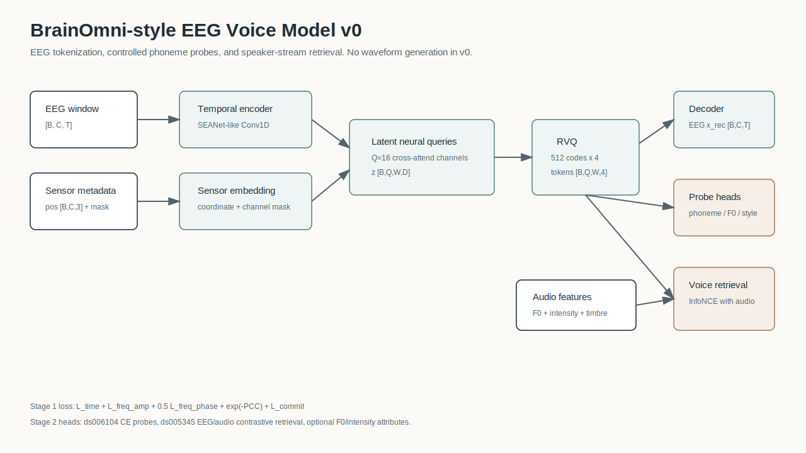
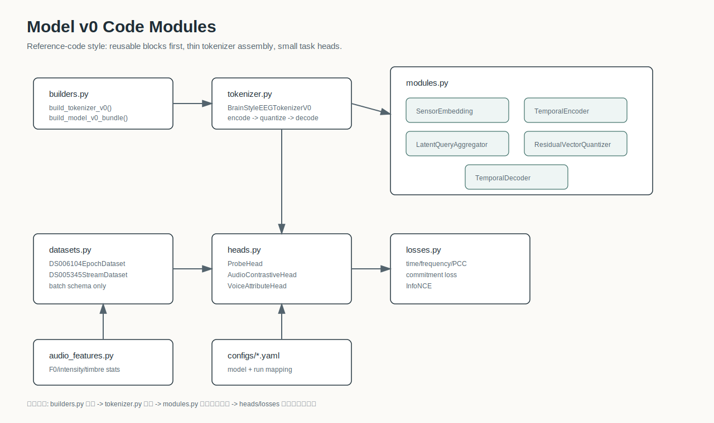
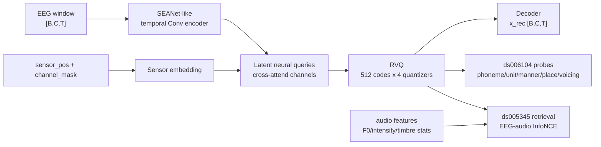

# BrainOmni-style EEG Voice Model v0

## 1. 目标

v0 不是语音波形生成器，而是一个可训练的中间层模型：

```text
EEG [B,C,T]
-> sensor-aware EEG tokenizer
-> discrete EEG tokens
-> ds006104 phoneme/articulatory probes
-> ds005345 speaker-stream retrieval
```

它服务于后续 AVH Voice Image Dataset 的基础链路：

```text
EEG -> token -> content / pitch / timbre / speaker-style alignment -> voice image retrieval
```

## 2. 组件图



代码模块图：



Mermaid 版本：



## 3. 模型接口

输入 batch：

```python
{
    "eeg": Tensor[B, C, T],
    "sensor_pos": Tensor[B, C, 3],
    "channel_mask": BoolTensor[B, C],
    "channel_names": list[str],
    "dataset_id": "ds006104" | "ds005345",
}
```

Tokenizer 输出：

```python
{
    "z": Tensor[B, Q, W, D],
    "z_q": Tensor[B, Q, W, D],
    "tokens": LongTensor[B, Q, W, num_quantizers],
    "x_rec": Tensor[B, C, T],
    "losses": {...}
}
```

默认配置：

```text
sample_rate = 250
window_sec = 2.0
dim = 256
latent_queries = 16
codebook_size = 512
num_quantizers = 4
```

## 4. BrainOmni 对应关系

v0 保留 BrainOmni/BrainTokenizer 的关键思想，但去掉 DeepSpeed、flash-attn 和大规模预训练复杂度。

| BrainOmni 组件 | v0 对应 |
| --- | --- |
| BrainSensorModule | `SensorEmbedding` |
| SEANetEncoder | `TemporalEncoder` |
| latent neuro queries + backward solution | `LatentQueryAggregator` |
| RVQ | `ResidualVectorQuantizer` |
| BrainTokenizerDecoder | `TemporalDecoder` |
| reconstruction objective | `tokenizer_reconstruction_loss` |

## 4.1 代码讲解顺序

建议按下面顺序讲模型，最容易让听众抓住结构：

```text
builders.py
-> tokenizer.py
-> modules.py
-> heads.py / losses.py
-> datasets.py / audio_features.py
```

核心文件职责：

| 文件 | 讲解重点 |
| --- | --- |
| `builders.py` | 用函数组装 tokenizer、probe heads、retrieval head，方便 notebook 或训练脚本调用 |
| `tokenizer.py` | 顶层 forward：`encode_continuous -> quantize -> reconstruct` |
| `modules.py` | 可单独解释的 BrainOmni-style building blocks |
| `heads.py` | ds006104 classification probe 与 ds005345 contrastive retrieval |
| `losses.py` | reconstruction、PCC、frequency、InfoNCE |

## 5. Loss

Stage 1 tokenizer:

```text
L_token = L_time
        + L_freq_amp
        + 0.5 * L_freq_phase
        + exp(-PCC)
        + L_commit
```

Stage 2 ds006104 probes:

```text
L_probe = CE(unit) + CE(phoneme/category/manner/place/voicing)
```

`tms_target` 不作为主目标，默认作为 nuisance/control metadata 保留。

Stage 2 ds005345 retrieval:

```text
z_eeg = pool(RVQ tokens)
z_audio = stream embedding(single_female/single_male/mix)
L_retrieval = InfoNCE(z_eeg, z_audio)
```

## 6. 数据集适配

### ds006104

入口：

```text
data/raw/openneuro/ds006104_datalad/sub-*/ses-*/eeg/*.edf
data/raw/openneuro/ds006104_datalad/sub-*/ses-*/eeg/*events.tsv
```

`DS006104EpochDataset` 按 `trial_type=stimulus` 建索引，读取 `onset` 附近的 EEG epoch，并输出：

```text
unit, phoneme, category, manner, place, voicing, tms_target
```

### ds005345

入口：

```text
data/raw/openneuro/ds005345_datalad/derivatives/sub-*/eeg/*_eeg_preprocessed.fif
data/raw/openneuro/ds005345_datalad/stimuli/*.wav
data/raw/openneuro/ds005345_datalad/annotation/*acoustic.csv
configs/ds005345_runs.yaml
```

run 条件不写死在代码里，只从 `configs/ds005345_runs.yaml` 读取。后续如核对发现 run 顺序不同，只改配置。

## 7. Dry-run

安装依赖后，先跑 synthetic tensor：

```bash
python3 scripts/model_v0_dryrun.py --mode synthetic
```

检查 ds005345 音频 stream embedding 和 run 配置：

```bash
python3 scripts/model_v0_dryrun.py --mode dataset-summary
```

注意：当前脚本不启动训练。

## 8. 后续扩展

- 用 HuBERT / wav2vec / speaker encoder 替换 v0 statistical audio embedding。
- 用真实 channel montage 替换缺失或零填充 sensor position。
- 增加 subject embedding 和 dataset embedding。
- 在 AVH Voice Image Dataset 中把 retrieval target 从 `single_female/male/mix` 扩展到 patient-specific voice bank。
