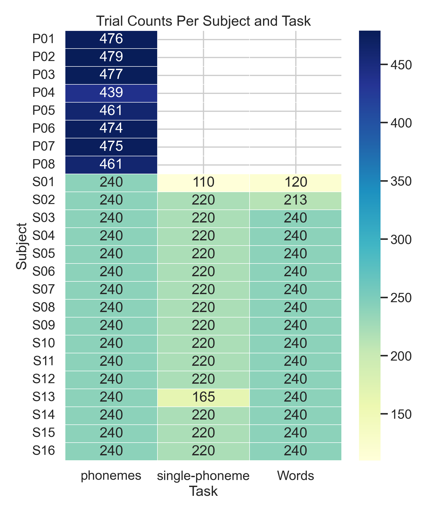
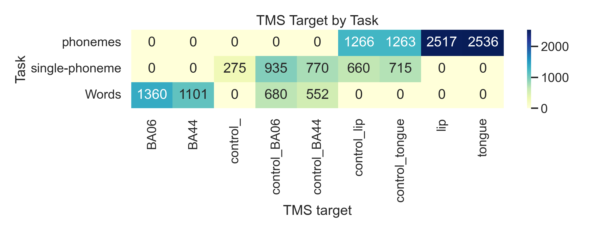
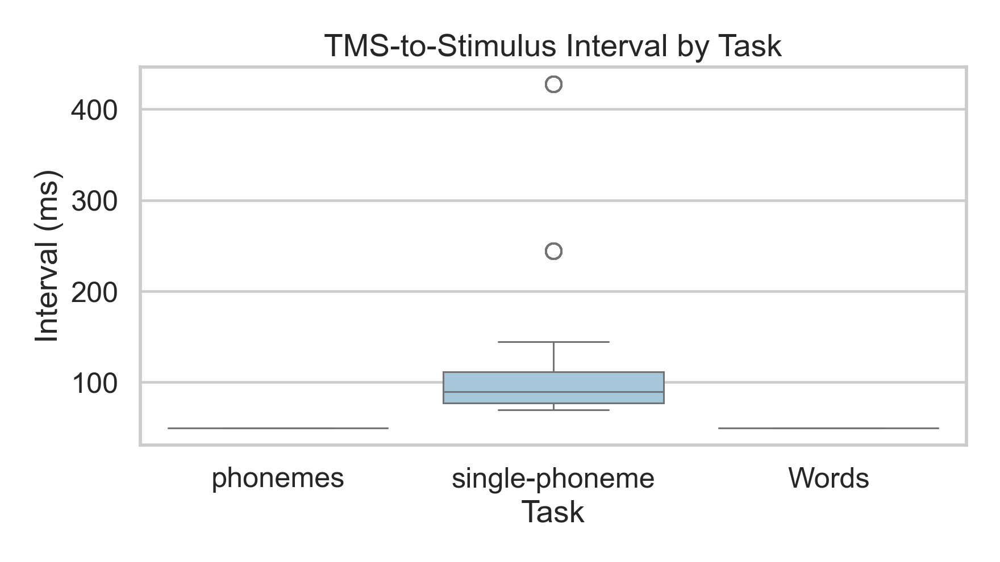
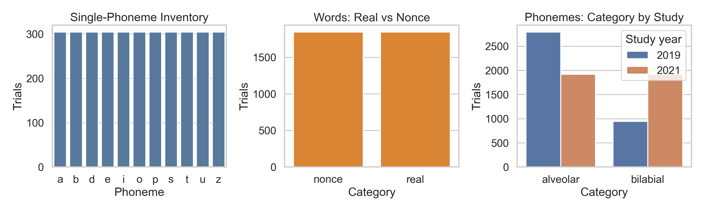
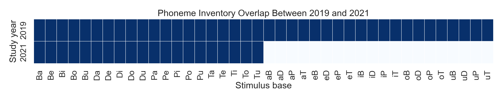
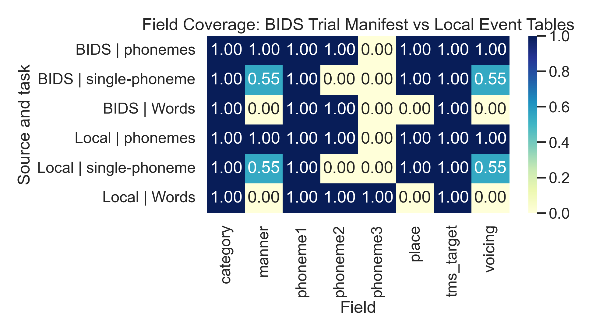

# ds006104 事件级数据分析

## 1. 先给结论

这次分析只基于 `ds006104/` 里的 `BIDS sidecars + events.tsv`，没有进入原始 EEG 波形训练或信号处理。

最重要的结果有 6 个：

1. 本地 `56` 个 `events.tsv` 文件都能稳定配对成 `TMS -> stimulus` trial，没有配对错误，共还原出 `14630` 个 trial。
2. 任务总量和之前本地事件表一致：
   - `2019 phonemes = 3742`
   - `2021 phonemes = 3840`
   - `2021 single-phoneme = 3355`
   - `2021 Words = 3693`
3. `single-phoneme` 是最干净的离散标签子集，`11` 个音完全均衡，每类 `305` 条，但它全部是 `control` 条件，不包含 active TMS。
4. `Words` 任务的 `real / nonce` 基本完全均衡，但只看 BIDS `events.tsv` 时，`phoneme3` 在 trial 级 manifest 里缺失，因此不能仅靠这份 BIDS 事件流恢复完整 `CVC` 单元。
5. `phonemes` 任务的跨年份可比性是存在的，但只限于 `20` 个 shared `CV` units；`2019` 额外多了 `20` 个 `VC` units，`2021` 没有新增独有 units。
6. 当前 `ds006104/` 虽然有 `56` 个 `.edf` git-annex 链接入口，但本地尚未 hydrated 成可直接读取的目标文件，所以现在更适合做事件级和元数据级分析，不适合直接做完整原始 EEG 波形分析。

## 2. 这次具体做了什么

分析脚本：

- [scripts/analyze_ds006104_bids.py](../scripts/analyze_ds006104_bids.py)

主要步骤：

1. 读取 `ds006104/` 下全部 `56` 个 `events.tsv`
2. 将每个 `TMS` 事件与后一个 `stimulus` 事件配成一个 trial
3. 生成 trial 级 manifest
4. 与本地 `events_information/` 标准化后的 manifest 做字段覆盖比较
5. 输出表格、图表和分析备注

输出目录：

- [exploration_outputs/ds006104_bids_analysis](../exploration_outputs/ds006104_bids_analysis)

## 3. 主要结果

### 3.1 任务规模和完整性

任务汇总表：

- [task_summary.csv](../exploration_outputs/ds006104_bids_analysis/tables/task_summary.csv)

核心规模如下：

- `2019 phonemes`：`8` 名被试，`3742` 个 trial，`40` 个 unit
- `2021 phonemes`：`16` 名被试，`3840` 个 trial，`20` 个 unit
- `2021 single-phoneme`：`16` 名被试，`3355` 个 trial，`11` 个 unit
- `2021 Words`：`16` 名被试，`3693` 个 trial，BIDS 可见 `17` 个 unit，本地事件表可恢复 `20` 个 lexical bases

被试与任务 trial 数热图：

这张图最值得注意的不是总量，而是完整性：

- `S01` 的 `Words` 只有 `120` 个 trial，低于常见值 `240`
- `S02` 的 `Words` 有 `213` 个 trial，也低于常见值 `240`
- `S01` 的 `single-phoneme` 只有 `110`
- `S13` 的 `single-phoneme` 只有 `165`

说明 `2021` 数据整体很整齐，但不是每个被试每个 block 都完全满额。

### 3.2 TMS 条件和任务绑定得很紧

TMS 条件热图：

对应表：

- [tms_target_by_task.csv](../exploration_outputs/ds006104_bids_analysis/tables/tms_target_by_task.csv)

这里可以直接读出 3 个结论：

1. `phonemes` 任务只和 `lip / tongue / control_lip / control_tongue` 绑定。
2. `Words` 任务只和 `BA06 / BA44 / control_BA06 / control_BA44` 绑定。
3. `single-phoneme` 任务全部是 `control` 条件，没有 active TMS。

这意味着：

- 任务之间不是共享同一套实验操控
- 后面如果做模型或分析，不能简单把三个任务混成一个统一条件空间

### 3.3 事件时间结构并不完全一致

时间间隔图：

对应表：

- [tms_interval_summary.csv](../exploration_outputs/ds006104_bids_analysis/tables/tms_interval_summary.csv)

结果很明确：

- `Words`：固定 `50 ms`
- `phonemes`：固定 `50 ms`
- `single-phoneme`：不是固定值，而是在 `70.0-427.5 ms` 之间变化，中位数 `89.5 ms`

这说明后面如果真要做 epoch 或对齐：

`single-phoneme 任务不能偷懒假设“所有 trial 的 TMS 到刺激间隔都一样”，必须用真实 recorded onset。`

### 3.4 标签空间本身已经能说明很多问题

核心标签分布图：

这张图对应 3 条最实用的判断：

1. `single-phoneme` 的 `11` 个音完全均衡，每类 `305` 条
2. `Words` 的 `real / nonce` 近乎完全均衡，分别是 `1846 / 1847`
3. `phonemes` 的 articulatory 类别不是均衡的，`alveolar` 明显多于 `bilabial`

所以如果只从“先做最简单的数据判断”这个角度：

- 最干净的是 `single-phoneme`
- 最稳的高层标签是 `real / nonce`
- `phonemes` 更适合做 articulatory 和跨年份结构分析，而不是假设它天然均衡

### 3.5 跨年份 overlap 是“有，但有限”

重合热图：

对应表：

- [phoneme_overlap_2019_2021.csv](../exploration_outputs/ds006104_bids_analysis/tables/phoneme_overlap_2019_2021.csv)

这里最核心的事实是：

- `2019` 的 `phonemes` 含 `40` 个 units
- `2021` 的 `phonemes` 含 `20` 个 units
- shared units 一共 `20`
- `2019` 额外多出来的正好是 `VC` 形式，如 `aB`, `eD`, `uT`

也就是说：

`如果后面要做跨年份比较，真正可稳妥对齐的是 20 个 shared CV units，不是整个 phoneme inventory。`

### 3.6 BIDS 事件流足够做结构分析，但字段并不完整

字段覆盖热图：

对应表：

- [field_coverage_bids_vs_local.csv](../exploration_outputs/ds006104_bids_analysis/tables/field_coverage_bids_vs_local.csv)

最值得注意的一点是：

- `Words` 任务里，BIDS trial manifest 的 `phoneme3` 非空比例是 `0.00`
- 同一个任务在本地事件表里的 `phoneme3` 非空比例是 `1.00`

这说明：

`如果只看 ds006104 里的 events.tsv，你能知道词级 trial 存在，但不能完整恢复所有 CVC 单元；要拿完整 lexical unit，仍然需要结合本地事件表。`

## 4. 对后续工作的意义

如果当前目标只是“先判断数据能不能用、先看哪块最值钱”，这次分析已经足够支持下面的判断：

### 4.1 现在最适合先看的子集

1. `2021 single-phoneme`
   - 标签最干净
   - 类别完全均衡
   - 最适合先做最基础的数据判断
2. `2021 Words`
   - `real / nonce` 很干净
   - 但完整 `CVC` 结构不能只靠 BIDS events 恢复
3. `phonemes`
   - 最适合看 articulatory 条件和跨年份 overlap
   - 但跨年份只能稳妥落在 `20` 个 shared CV units 上

### 4.2 现在还不适合直接做什么

当前这轮分析不支持直接进入：

- 完整原始 EEG 波形分析
- 基于本地 `ds006104/` 直接训练
- `EEG -> voice` 级别的监督构造

原因不是数据没价值，而是：

1. 当前本地 `.edf` 还没 hydrated
2. BIDS 事件流本身对词级 `phoneme3` 信息不完整
3. 现在最清楚的监督还是离散 unit 和条件标签

## 5. 最值得记住的结论

这次分析之后，可以把 `ds006104` 的定位收成一句话：

`它现在已经足够做严肃的数据结构分析和 trial-level 事件分析，但如果要进入完整 EEG 读取或更细粒度 speech-unit 对齐，还需要补全本地原始信号和词级字段。`

## 6. 结果文件

核心输出：

- [bids_trial_manifest.csv](../exploration_outputs/ds006104_bids_analysis/tables/bids_trial_manifest.csv)
- [task_summary.csv](../exploration_outputs/ds006104_bids_analysis/tables/task_summary.csv)
- [subject_task_trial_counts.csv](../exploration_outputs/ds006104_bids_analysis/tables/subject_task_trial_counts.csv)
- [tms_interval_summary.csv](../exploration_outputs/ds006104_bids_analysis/tables/tms_interval_summary.csv)
- [analysis_notes.csv](../exploration_outputs/ds006104_bids_analysis/tables/analysis_notes.csv)
