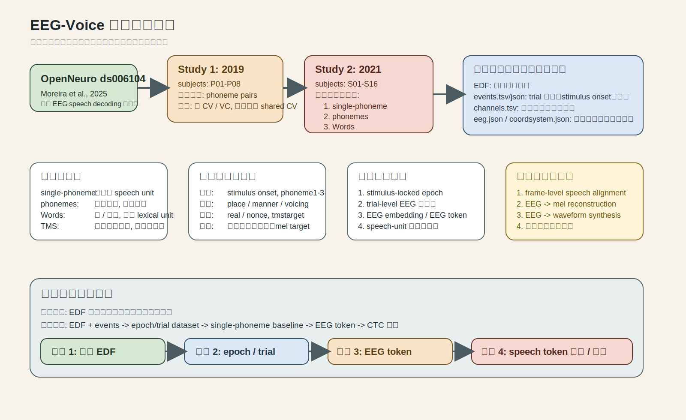
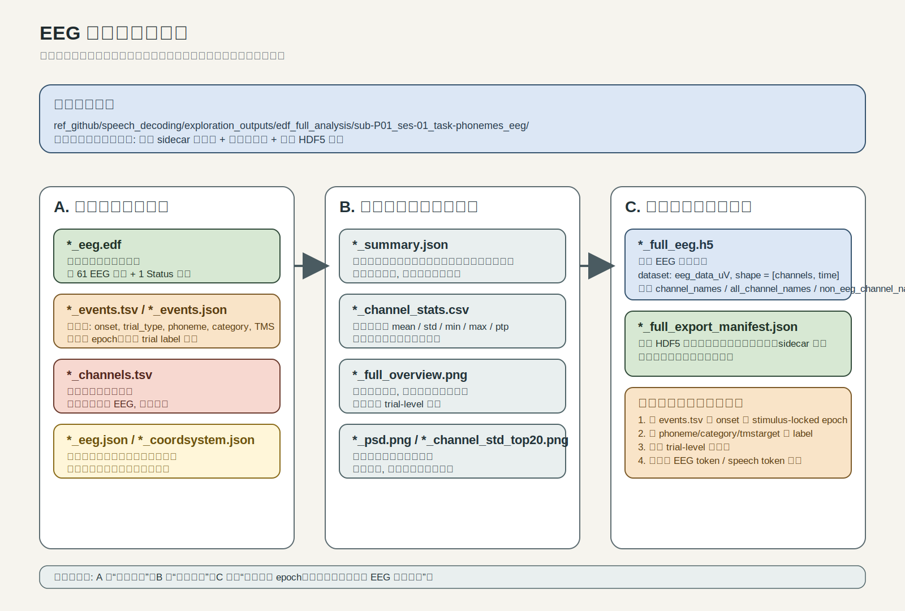

# EEG 数据导图与说明图

下面两张图是给当前项目状态专门做的。

## 1. 数据说明导图

这张图回答 4 个问题：

1. 数据源是什么
2. 任务层级怎么分
3. 当前有哪类监督
4. 你现在最适合往哪条研究路线走

最重要的结论只有一句：

`这套数据现在最适合做 speech-unit 级 EEG token 学习，不适合直接写成 EEG-to-voice 重建。`

## 2. 数据结构说明图

这张图回答的是：

1. 单个记录目录里到底有哪些文件
2. 每个文件分别代表什么
3. 哪些只是描述性结果
4. 哪些才是真正后面能拿去切 epoch 和训练的完整数据

一句话理解：

- `EDF + sidecars` 是原始定义
- `summary / PSD / 概览图` 是体检报告
- `*_full_eeg.h5` 才是完整导出的 EEG 数据本体

## 3. 你现在最该怎么理解这些数据

建议按下面顺序理解：

1. `*_events.tsv/json`
   先看 trial 和 stimulus 的定义
2. `*_full_eeg.h5`
   再看完整 EEG 矩阵
3. `*_full_export_manifest.json`
   核对采样率、通道、sidecar
4. `*_summary.json` 和图表
   把它们当成快速体检，不要当主数据

## 4. 下一步最自然的工作

如果你现在的目标是继续把研究往前推，下一步最自然的是：

1. 从 `*_full_eeg.h5` 和 `*_events.tsv` 切 stimulus-locked epoch
2. 形成 trial-level 数据集
3. 先在 `2021 single-phoneme` 上做第一版 baseline

这样才会从“看数据”进入“真正可训练的数据准备”。
